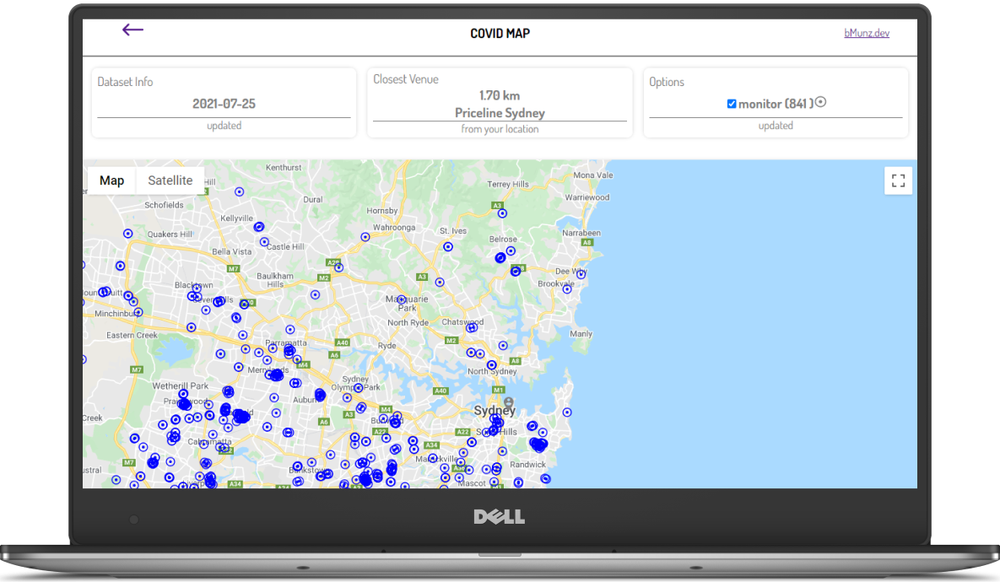

# COVID MAP

*Project to show the location of venues associated with confirmed COVID-19 cases that have been classified by NSW Health for action. It shows the closet location from your position using the browser location API if this is allowed.*

## Technologies
  * Next.js
  * react-query
  * Google Maps
  * Google Maps JavaScript API
  * styled-components

### TO-DO
  * highlight closest venue in the map
  * functionality: given an address show how close it is from venues with associated cases.

***
#### CONTACT ME: 
  * [Personal Portfolio ](https://www.bmunz.dev)
  * munzbe@gmail.com
  * [twitter ](https://twitter.com/moonbe77)
***